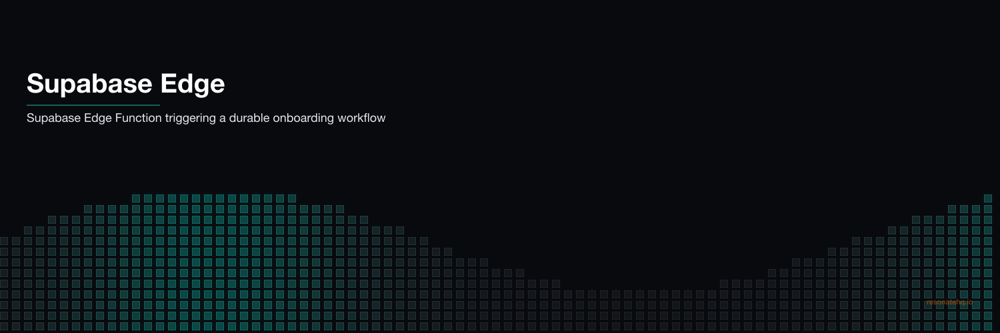

<p align="center">
  
</p>

# Supabase Edge Functions + Resonate

Durable workflows triggered by Supabase Database changes — powered by Resonate.

When a new user signs up, a Supabase Database Webhook fires your Edge Function. Resonate makes the multi-step onboarding workflow durable — if the SMTP server times out, the email is retried without re-running the validation. If the edge function times out mid-workflow, it resumes from the last checkpoint on the next invocation.

```
Supabase DB: INSERT into users
      ↓
Database Webhook → POST /functions/v1/flows
      ↓
Edge Function: resonate.run("onboard/usr_123", onboardUser, user)
      ↓
Workflow: validate → send email → provision trial → notify CRM
      ↓
Each step checkpointed — retries resume from last checkpoint
```

## The integration pattern

```typescript
// supabase/functions/flows/index.ts
import { Resonate, type Context } from "@resonatehq/supabase";

function* onboardUser(ctx: Context, user: UserRecord) {
  yield* ctx.run(validateUser, user);           // Step 1 — checkpointed
  yield* ctx.run(sendWelcomeEmail, user);       // Step 2 — retried on SMTP failure
  const workspaceId = yield* ctx.run(provisionTrial, user);  // Step 3
  yield* ctx.run(notifyCRM, user, workspaceId); // Step 4
  return { userId: user.id, emailSent: true, ... };
}

const resonate = new Resonate();  // reads RESONATE_URL from env
resonate.register("onboardUser", onboardUser);

// Handle Database Webhook + Resonate execution callbacks
Deno.serve(async (req) => {
  const payload = await req.json();
  if (payload.type === "INSERT" && payload.table === "users") {
    // user.id is the idempotency key — webhook fires twice → runs once
    const result = await resonate.run(`onboard/${payload.record.id}`, onboardUser, payload.record);
    return new Response(JSON.stringify({ status: "ok", result }));
  }
  return resonate.handler(req);  // Resonate internal callbacks
});
```

**Compare to Trigger.dev:** Trigger.dev requires defining tasks in a separate `/trigger` directory and running `trigger.dev dev`. With Resonate, the workflow runs inside your edge function — same process, same file.

## Architecture

```
Supabase                          Resonate Server
  │                                     │
  │  DB INSERT → Webhook                │
  │  → /functions/v1/flows              │
  │       │                             │
  │       ├── resonate.run()  ─────────▶│ Create/resume promise
  │       │                  ◀─────────┤ Return state + next step
  │       │                             │
  │       ├── Step 1: validateUser      │
  │       │   checkpoint ──────────────▶│ Store result
  │       │                             │
  │       ├── Step 2: sendWelcomeEmail  │
  │       │   checkpoint ──────────────▶│ Store result
  │       │                             │
  │       └── ... (steps 3, 4)         │
```

The Resonate Server holds durable state between edge function invocations. The edge function is stateless; the workflow is not.

## Files

```
supabase/
  functions/
    flows/
      index.ts     — Workflow definitions + Database Webhook handler
      deno.json    — Deno import map (@resonatehq/supabase)
    start/
      index.ts     — Optional: trigger workflows by name via HTTP
    probe/
      index.ts     — Optional: poll workflow status by UUID

local-demo/
  src/index.ts    — Same workflow logic, runs locally with @resonatehq/sdk
  package.json
```

## Prerequisites

### For local demo (no Supabase account needed)

- Node.js 18+
- `cd local-demo && npm install`

### For Supabase deployment

- [Supabase CLI](https://supabase.com/docs/guides/cli): `npm install -g supabase`
- [Supabase account](https://supabase.com) with a project
- A running [Resonate Server](https://docs.resonatehq.io/server/install) (hosted or `resonate serve`)

## Run it locally

### Happy path

```bash
cd local-demo
npm start
```

**Output:**
```
=== Supabase Edge Function + Resonate Demo ===
Mode: HAPPY PATH (all 4 steps complete successfully)

[webhook]    Database trigger fired:
             table: users, type: INSERT
             user: alice@example.com (usr_1234567890)

[validate]   user usr_1234567890 (alice@example.com) — OK
[email]      Sending welcome email to alice@example.com...
[email]      Welcome email sent to alice@example.com
[provision]  Provisioning free trial for usr_1234567890...
[provision]  Trial workspace created: ws_usr_1234
[crm]        Syncing user usr_1234567890 → CRM (workspace: ws_usr_1234)
[crm]        CRM updated
```

### Crash / retry demo

```bash
cd local-demo
npm run start:crash
```

**What you'll observe:**
- SMTP times out on first attempt
- `sendWelcomeEmail` retried automatically after 2 seconds
- `validateUser` does **not** re-run — its result is checkpointed
- Provision and CRM sync only run after email succeeds

## Deploy to Supabase

### 1. Set up the Resonate Server

```bash
# Install and run the Resonate Server
resonate serve
# Or use Resonate Cloud (see https://resonatehq.io)
```

### 2. Configure Supabase secrets

```bash
supabase secrets set RESONATE_URL=http://your-resonate-server:8001
supabase secrets set RESONATE_AUTH_TOKEN=your-token  # if auth enabled
```

### 3. Deploy the edge functions

```bash
supabase functions deploy flows
supabase functions deploy start
supabase functions deploy probe
```

### 4. Set up the Database Webhook

In your Supabase dashboard:
1. Go to **Database → Webhooks → Create a new hook**
2. Name: `onboard-new-users`
3. Table: `users`
4. Events: `INSERT`
5. Type: **Supabase Edge Functions**
6. Edge Function: `flows`

### 5. Test it

```bash
# Insert a test user — triggers the webhook
supabase db execute --command "INSERT INTO users (id, email, full_name, plan) VALUES ('test-001', 'test@example.com', 'Test User', 'free')"

# Check status
curl -X POST "$SUPABASE_URL/functions/v1/probe" \
  -H "Authorization: Bearer $SUPABASE_ANON_KEY" \
  -H "Content-Type: application/json" \
  -d '{"uuid": "onboard/test-001"}'
```

## What makes this durable

**Without Resonate:** If the SMTP server times out, your edge function errors out. The webhook won't retry the failed step — it'll either retry the entire workflow (potentially re-sending the welcome email) or just fail silently.

**With Resonate:** Each step is checkpointed. If `sendWelcomeEmail` fails, only `sendWelcomeEmail` is retried. The database validation doesn't re-run. The welcome email is sent exactly once.

[Try Resonate →](https://resonatehq.io) · [Resonate SDK →](https://github.com/resonatehq/resonate-sdk-ts)
